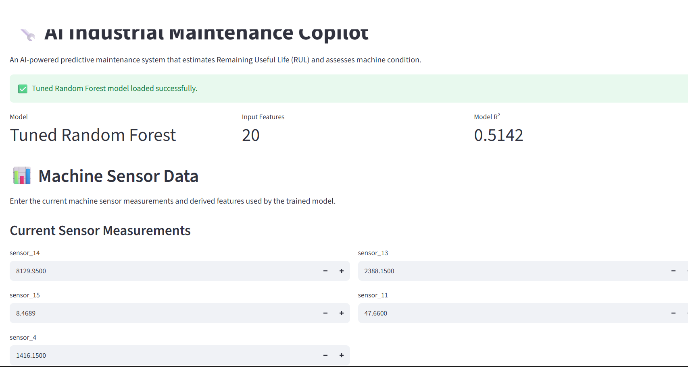
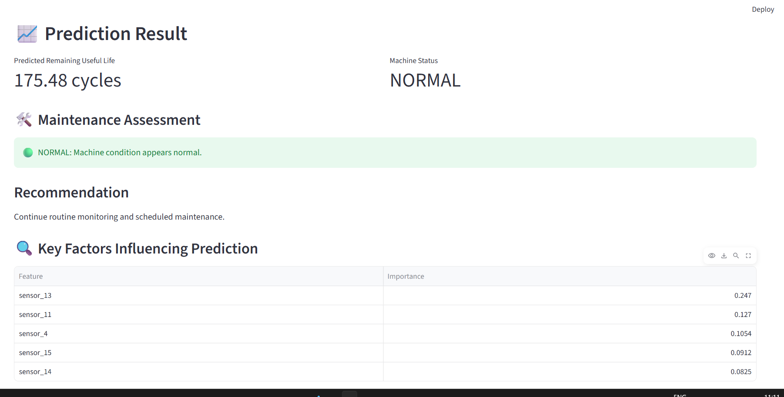
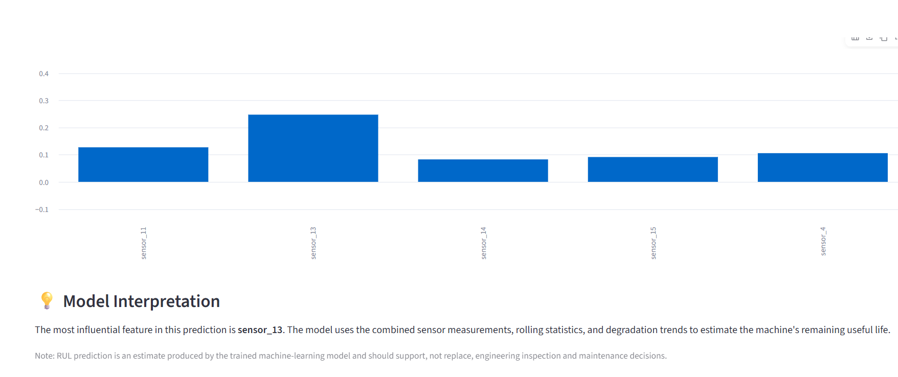

# AI Industrial Maintenance Copilot

An AI-powered predictive maintenance system that estimates the Remaining Useful Life (RUL) of industrial machinery from sensor data and provides a maintenance condition assessment.

## Overview

The system predicts how many operational cycles a machine has remaining before failure and uses the prediction to support maintenance decisions.

## Dataset

This project uses the **NASA C-MAPSS FD004 turbofan engine dataset**.

The dataset contains:

- Engine identifiers
- Operating cycles
- Operating settings
- Multiple sensor measurements
- Remaining Useful Life (RUL)

> Dataset files are not included in this repository.

## Approach

The project follows the pipeline:

**Dataset → Data Analysis → Sensor Selection → Feature Engineering → Data Cleaning → Train/Test Split → Feature Scaling → Model Training → Model Evaluation → Model Saving → Streamlit Deployment**

## Feature Engineering

Five important sensors were selected based on statistical analysis and correlation:

- `sensor_14`
- `sensor_13`
- `sensor_15`
- `sensor_11`
- `sensor_4`

For each selected sensor, additional features were created using:

- Rolling mean
- Rolling standard deviation
- Trend

This resulted in **20 model features**.

## Models

Three regression models were evaluated:

1. Linear Regression
2. Random Forest Regressor
3. Gradient Boosting Regressor

A tuned **Random Forest Regressor** was selected as the final model.

## Model Performance

| Metric | Value |
|---|---:|
| MAE | 45.05 cycles |
| RMSE | 61.82 cycles |
| R² | 0.5142 |

## Important Features

The most influential features in the final model were:

| Feature | Importance |
|---|---:|
| `sensor_13` | 0.247005 |
| `sensor_11` | 0.126967 |
| `sensor_4` | 0.105417 |
| `sensor_15` | 0.091204 |
| `sensor_14` | 0.082514 |

## Maintenance Assessment

The predicted RUL is converted into a machine condition:

| Predicted RUL | Condition |
|---:|---|
| ≤ 30 cycles | CRITICAL |
| 31–75 cycles | WARNING |
| 76–150 cycles | MONITOR |
| > 150 cycles | NORMAL |

The application also provides a maintenance recommendation based on the predicted condition.

## Application

The trained model is integrated into a **Streamlit web application** that provides:

- Sensor input interface
- RUL prediction
- Machine condition assessment
- Maintenance recommendation
- Feature importance visualization
- Model interpretation

### Application Interface



### Prediction & Maintenance Assessment



### Model Interpretation



## Example Prediction

For one test sample:

- **Actual RUL:** 220 cycles
- **Predicted RUL:** 175.48 cycles
- **Machine Condition:** NORMAL

## Saved Model Components

The application uses the following saved model components:

- `tuned_random_forest.pkl` — trained Random Forest model
- `scaler.pkl` — feature scaler
- `feature_names.pkl` — model feature order

## Project Structure

```text
AI-Industrial-Maintenance-Copilot/
│
├── app/
│   └── app.py
│
├── assets/
│   ├── app_interface.png
│   ├── prediction_result.png
│   └── model_interpretation.png
│
├── models/
│   ├── feature_names.pkl
│   ├── scaler.pkl
│   └── tuned_random_forest.pkl
│
├── .gitignore
├── README.md
└── requirements.txt